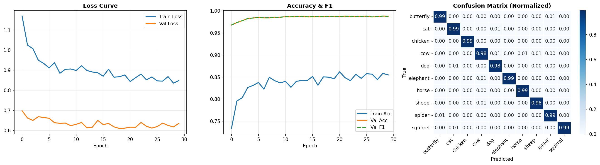
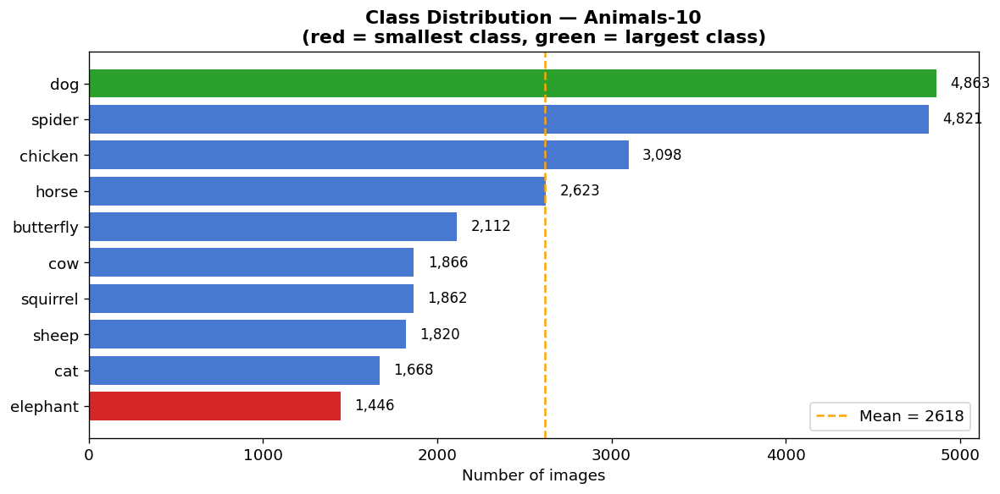
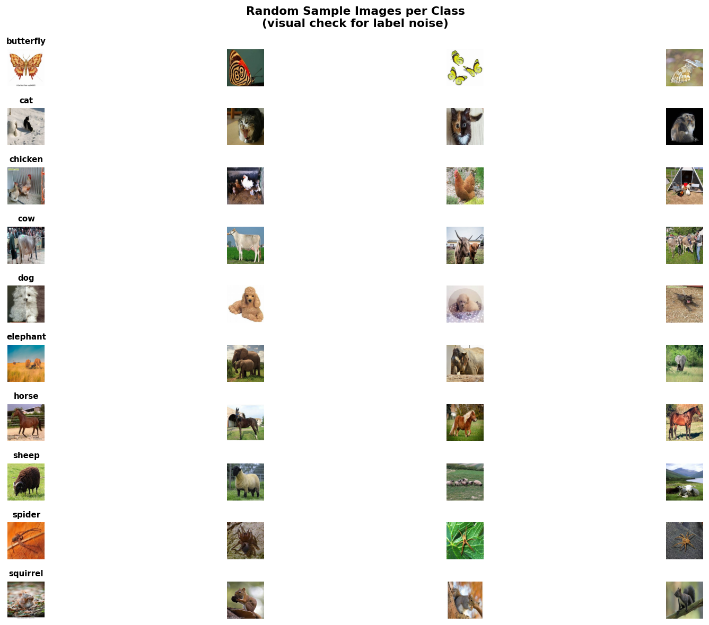
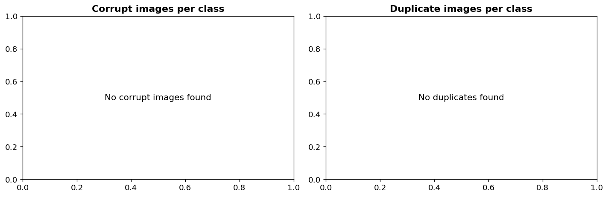
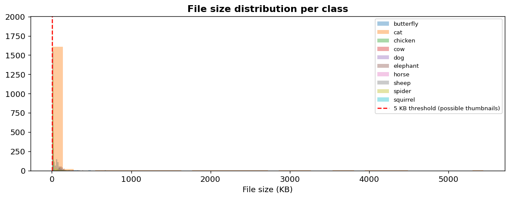

# Animal Image Classifier

A production-ready multi-class image classification system built with **EfficientNet-B3** and **PyTorch**, trained on the Animals-10 dataset (~26,000 images across 10 classes).

🔴 **[Live Demo](https://huggingface.co/spaces/Karthik1610/animal-classifier)** &nbsp;|&nbsp; 📦 **[Model on Hugging Face](https://huggingface.co/spaces/Karthik1610/animal-classifier)**

---

## Results

| Metric | Score |
|---|---|
| Validation Accuracy | **98.80%** |
| Weighted F1 Score | **0.9880** |
| Lowest per-class F1 | **0.9778** (cow) |
| Highest per-class F1 | **0.9936** (spider) |



---

## Per-class F1 Scores

| Class | F1 Score | EDA Count |
|---|---|---|
| Spider | 0.9936 | 4,821 |
| Elephant | 0.9915 | 1,446 |
| Horse | 0.9908 | 2,623 |
| Chicken | 0.9906 | 3,098 |
| Squirrel | 0.9892 | 1,862 |
| Dog | 0.9875 | 4,863 |
| Butterfly | 0.9858 | 2,112 |
| Sheep | 0.9832 | 1,820 |
| Cat | 0.9802 | 1,668 |
| Cow | 0.9778 | 1,866 |

> Elephant had the fewest images (1,446) yet achieved F1 of 0.9915 — demonstrating that our class imbalance handling worked effectively.

---

## Project Structure

```
animal-classifier/
├── notebooks/
│   ├── 01_eda.ipynb           # Exploratory data analysis
│   └── 02_training.ipynb      # Full training pipeline
├── app/
│   └── app.py                 # Gradio web app (ONNX inference)
├── eda_outputs/               # EDA plots
├── examples/                  # Sample images for demo
├── results/
│   └── training_results.png   # Loss, accuracy, confusion matrix
├── metadata.json              # Class names, metrics, config
└── requirements.txt
```

---

## Exploratory Data Analysis

EDA was performed before any training decisions were made. All model and pipeline choices are justified by data findings.

**Class distribution** — 3.36x imbalance ratio detected (dog: 4,863 vs elephant: 1,446):



**Visual label check** — random samples per class inspected for label noise:



**Data quality** — zero corrupt files, zero duplicates found via MD5 hashing:



**File size distribution** — checked for suspiciously small thumbnail files:



---

## EDA-Driven Training Decisions

| Finding | Decision |
|---|---|
| Imbalance ratio 3.36x (> 1.5x threshold) | WeightedRandomSampler + class-weighted CrossEntropyLoss |
| Image sizes vary from 60px to 6,720px | Heavy augmentation: random crop, flip, color jitter, erasing |
| Real-world photo variation | Mixup augmentation to improve generalisation |
| Zero corrupt / duplicate files | Confirmed clean — no files removed |

---

## Model Architecture

- **Base**: EfficientNet-B3 pretrained on ImageNet
- **Custom head**: Dropout(0.45) → Linear(512) → SiLU → Dropout(0.30) → Linear(10)
- **Training strategy**: 3-epoch warmup (head only) → full backbone fine-tuning
- **Loss**: CrossEntropyLoss with class weights + label smoothing (0.1)
- **Optimizer**: AdamW with differential learning rates
- **Scheduler**: CosineAnnealingWarmRestarts

---

## Production Features

- ✅ **Class imbalance handling** — WeightedRandomSampler + class-weighted loss (3.36x ratio)
- ✅ **Corrupt image filtering** — PIL verify + load check on every file
- ✅ **Duplicate removal** — MD5 hash deduplication before training
- ✅ **Confidence threshold** — predictions below 0.60 rejected as uncertain (OOD handling)
- ✅ **Label smoothing** — prevents overconfident softmax outputs
- ✅ **Mixup augmentation** — virtual samples improve minority class generalisation
- ✅ **Early stopping** — patience of 7 epochs, best checkpoint restored automatically
- ✅ **Model export** — ONNX (opset 18) + TorchScript for deployment flexibility

---

## Model Export

```python
# ONNX export
torch.onnx.export(model, dummy, "model.onnx",
    opset_version=18, dynamic_axes={"input":{0:"batch"},"output":{0:"batch"}})

# TorchScript export
scripted = torch.jit.trace(model, dummy)
scripted.save("model_scripted.pt")
```

The live demo runs the **ONNX model directly** via `onnxruntime` — no PyTorch dependency at inference time.

---

## Setup

```bash
git clone https://github.com/karthik-1604/animal-classifier
cd animal-classifier
pip install -r requirements.txt
```

**Run the app locally:**
```bash
python app/app.py
```

**Train from scratch** — open `notebooks/02_training.ipynb` on Kaggle with GPU T4 enabled and the [Animals-10 dataset](https://www.kaggle.com/datasets/alessiocorrado99/animals10) added.

---

## Requirements

```
torch>=2.0.0
torchvision>=0.15.0
onnxruntime>=1.17.0
gradio>=4.0.0
Pillow>=9.0.0
numpy>=1.24.0
scikit-learn>=1.3.0
matplotlib>=3.7.0
seaborn>=0.12.0
```

---

## Dataset

**Animals-10** by Alessio Corrado — [kaggle.com/datasets/alessiocorrado99/animals10](https://www.kaggle.com/datasets/alessiocorrado99/animals10)

~26,000 real-world animal images across 10 classes. Original folder names are in Italian — remapped to English during preprocessing.

---

## Acknowledgements

- Dataset: [Animals-10](https://www.kaggle.com/datasets/alessiocorrado99/animals10) (Kaggle)
- Model: [EfficientNet-B3](https://arxiv.org/abs/1905.11946) (Tan & Le, 2019)
- Deployed on [Hugging Face Spaces](https://huggingface.co/spaces)
